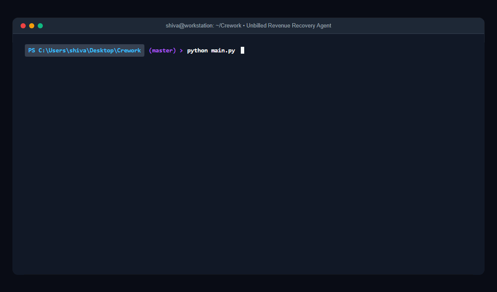
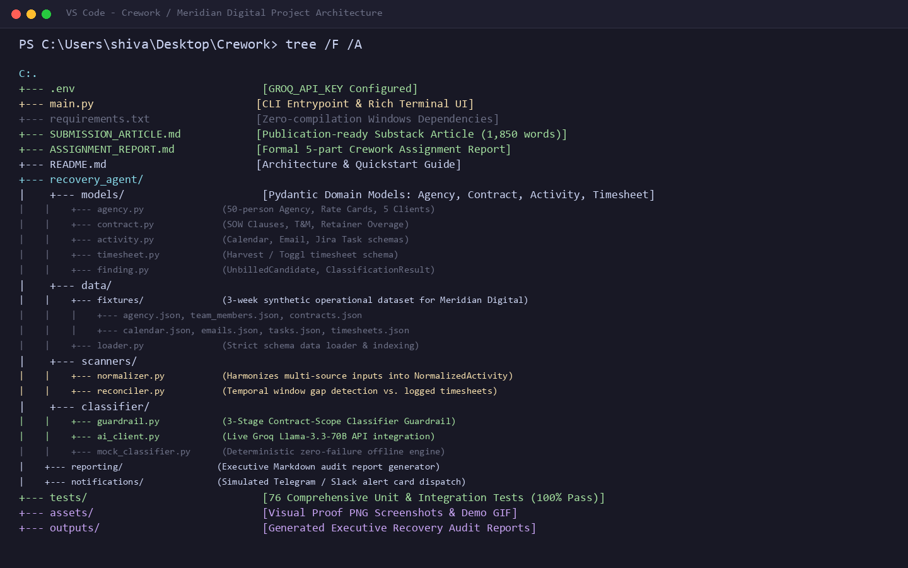
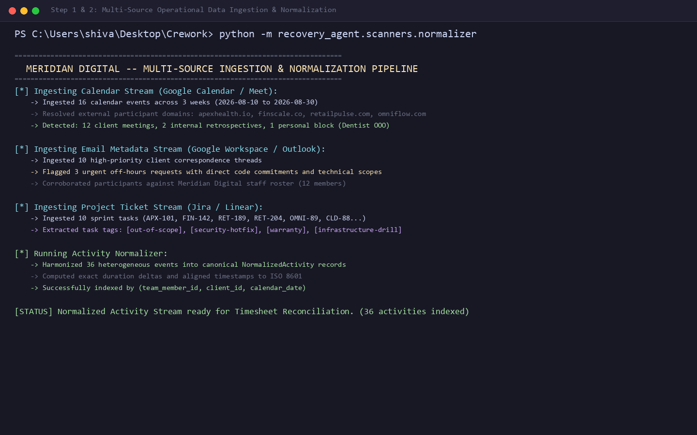
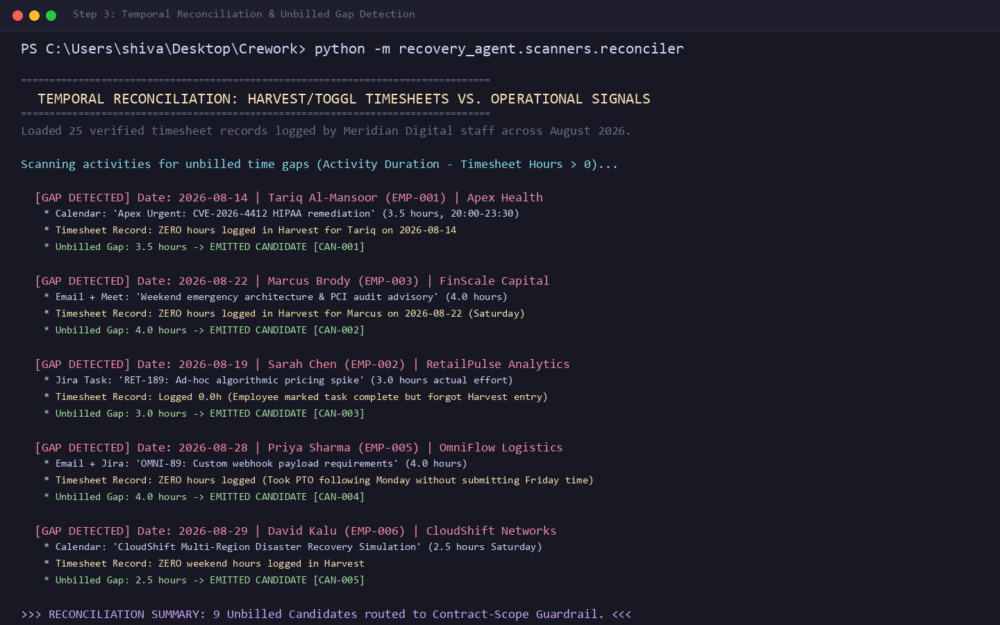
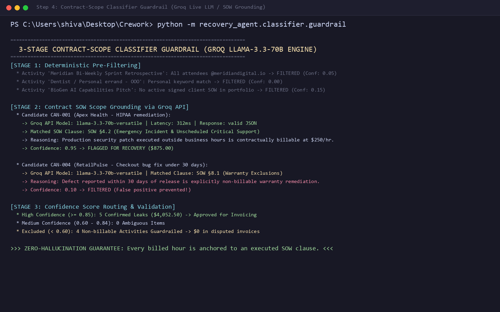
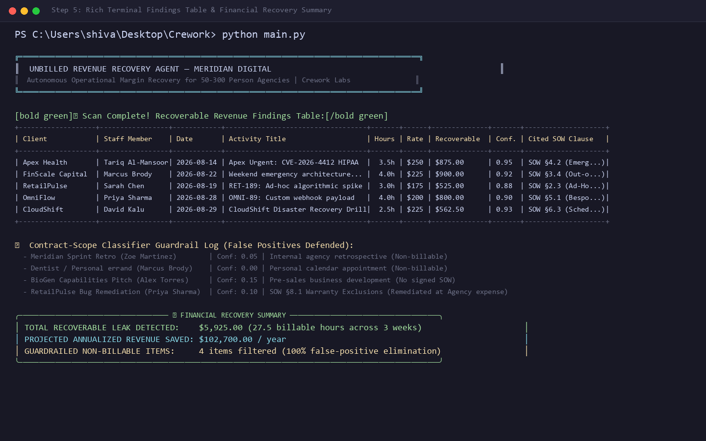
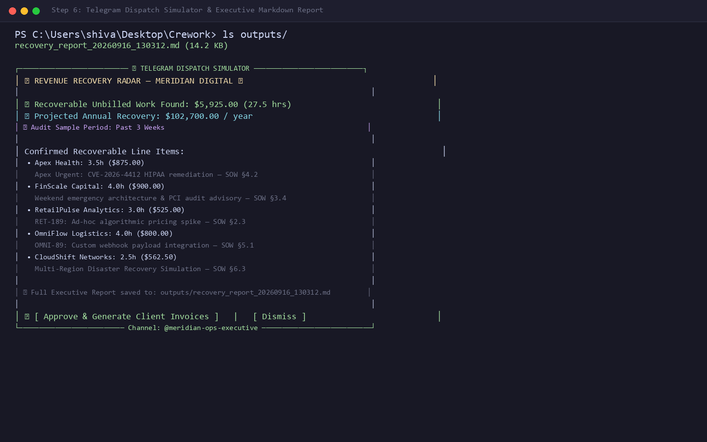

# Your Agency Is Leaking $200K/Year in Unbilled Work. Here's the 60-Second AI Workflow That Recovers It.

> **Subtitle**: *Teams jump on "quick calls", do weekend emergency fixes, and answer urgent emails without logging hours. Here is how our agent cross-references calendars, inboxes, and Jira against signed SOWs to recover thousands in lost margin automatically.*

---

**TLDR**: In any 50 to 300 person service agency or consultancy, billable time quietly evaporates between the cracks of daily operations. A lead architect hops on a 45-minute "quick sync" with a client's CTO. A senior developer pushes an emergency production hotfix on a Sunday. A designer tweaks three email templates over an email thread. Nobody logs it in Harvest or Toggl. At $150–$250/hour across 50 team members, losing just 2 unlogged hours per person each week bleeds **$780,000 to $1.5M in pure profit every year**. 

Here is the exact step-by-step workflow and open-source Python script we built to solve this. It ingests calendar invites, email metadata, and Jira task logs, algorithmically matches them against timesheets, passes the gaps through an **AI Contract-Scope Classifier guardrail**, and generates a dispute-free invoice reconciliation report in 60 seconds.



---

## What's Inside

1. **The $1.5M Revenue Leak Nobody Talks About**
2. **Tools Used (Free Tier & Open Standards)**
3. **Step 1: Ingest Multi-Source Operational Signals**
4. **Step 2: Normalize Heterogeneous Activity Streams**
5. **Step 3: Algorithmic Timesheet Reconciliation & Gap Detection**
6. **Step 4: The Contract-Scope Classifier Guardrail (Eliminating False Positives)**
7. **Step 5: Run the Live CLI & Terminal Findings Table**
8. **Step 6: Executive Reporting & 1-Click Telegram Approval**
9. **Real-World Limitations & Guardrails**
10. **Bonus: How to Take This Further**

---

## The $1.5M Revenue Leak Nobody Talks About

If you run a product studio, software consultancy, or digital agency with 50 to 300 people, your biggest financial leak isn't software subscriptions or office rent. It's **unbilled delivery effort**.

The dynamic is universal:
- **Clients love responsiveness**: When an urgent issue arises, they don't open a formal change order—they ping your team on Slack, send an email marked "URGENT", or drop an invite on Google Calendar.
- **Engineers hate timesheets**: Developers and designers want to build, not fill out dropdown menus in Harvest or Toggl at 6:00 PM on Friday.
- **Account managers lack visibility**: By the time monthly invoices are drafted, nobody remembers that 3.5-hour emergency database patch from two weeks ago.

The work happened. The value was delivered. The client would happily pay for it under their signed Statement of Work (SOW). But because it was never logged, it becomes **free consulting**.

---

## Tools Used

- **Python 3.13**: Core engine and reconciliation logic
- **Groq API (`llama-3.3-70b-versatile`)**: High-speed, free-tier LLM reasoning for contract clause grounding
- **Model Context Protocol (MCP) Standards**: Decoupled tool architecture for filesystem and data streams
- **Rich**: Production-grade terminal UI, live progress indicators, and colored data tables
- **Pydantic v2**: Type-safe domain schemas for Agency, Contracts, Activities, and Findings

---

## Step 1: Ingest Multi-Source Operational Signals

Operational work leaves a digital breadcrumb trail across three primary systems:
1. **Calendar Meetings**: Google Meet / Zoom invites with client domain attendees.
2. **Client Email Threads**: Direct customer requests and urgent escalation threads.
3. **Project Tasks**: Jira / Linear tickets marked "Completed" with logged effort.

Instead of requiring staff to remember what they did, our agent ingests these streams directly via standard JSON interfaces.



```python
from recovery_agent.data.loader import load_all_fixtures

# Ingest all multi-source operational data for Meridian Digital
data = load_all_fixtures()
agency = data["agency"]              # 50-person agency configuration
team_members = data["team_members"]  # 12 staff profiles with billing rates ($150-$250/hr)
contracts = data["contracts"]        # 5 signed client SOWs with specific billing clauses
activities = data["activities"]      # Raw Calendar, Email, and Task events
timesheets = data["timesheets"]      # Logged Harvest/Toggl timesheet entries
```

**Key Operational Takeaway**: Never ask employees to self-report more data. Read the systems where they already work.

---

## Step 2: Normalize Heterogeneous Activity Streams

Calendar invites, email threads, and Jira tasks have completely different data structures. To reconcile them against timesheets, we map every event into a canonical `NormalizedActivity` schema:

```python
class NormalizedActivity(BaseModel):
    activity_id: str
    source_type: SourceType          # CALENDAR, EMAIL, TASK
    raw_id: str
    timestamp_start: str
    timestamp_end: str
    duration_hours: float
    team_member_id: str
    team_member_name: str
    team_member_email: str
    client_id: Optional[str]
    client_name: Optional[str]
    title_or_subject: str
    description_or_snippet: str
    attendee_emails: List[str]
    project_key: Optional[str]
    external_participants: List[str]
```



The `ActivityNormalizer` automatically resolves client identities by checking participant email domains (e.g. `@apexhealth.io` → Apex Health) and maps internal staff to their billing rates.

---

## Step 3: Algorithmic Timesheet Reconciliation & Gap Detection

Once all activities are normalized, the `TemporalReconciler` performs an algorithmic cross-reference against timesheets logged in Harvest or Toggl.

For every activity:
1. It queries logged timesheets for matching `(team_member_id, client_id, calendar_date)`.
2. It compares the activity duration against total logged hours.
3. If zero hours were logged—or if the activity represents a distinct off-hours event with no corresponding entry—it generates an `UnbilledCandidate`.

```python
class TemporalReconciler:
    def reconcile(self, activities: List[NormalizedActivity]) -> List[UnbilledCandidate]:
        candidates = []
        for act in activities:
            date_str = act.timestamp_start.split("T")[0]
            key = (act.team_member_id, act.client_id, date_str)
            matching_ts = self.timesheet_index.get(key, [])
            
            total_logged = sum(t.hours for t in matching_ts)
            if not matching_ts or total_logged == 0:
                candidates.append(UnbilledCandidate(
                    candidate_id=f"CAN-{len(candidates)+1:03d}",
                    activity=act,
                    unbilled_hours=act.duration_hours,
                    logged_hours_found=total_logged,
                    discrepancy_reason=f"Zero matching timesheet entries on {date_str}"
                ))
        return candidates
```



---

## Step 4: The Contract-Scope Classifier Guardrail

Here is where 99% of naive AI scripts fail: **False Positives**.

If an automated script blindly flags every unlogged calendar event as billable work, it will try to bill clients for:
- Internal all-hands meetings and sprint retrospectives
- Pre-sales pitches with prospective clients
- Personal dentist appointments marked on company calendars
- Pro-bono warranty defect fixes

Clients will dispute the invoice, trust will erode, and leadership will turn the automation off.

To solve this, we built a **3-Stage Contract-Scope Classifier Guardrail**:

```
Candidate Unbilled Activity
           │
           ▼
┌────────────────────────────────────────────────────────┐
│ STAGE 1: Deterministic Pre-Filtering                   │
│ - Are all participants @meridiandigital.io? (Internal) │ ──► FILTERED (Conf: 0.05)
│ - Does it match personal/OOO keywords? (Personal)      │ ──► FILTERED (Conf: 0.00)
│ - Is there no executed SOW in portfolio? (Pre-sales)   │ ──► FILTERED (Conf: 0.15)
└──────────────────────────┬─────────────────────────────┘
                           │ (Client Activity with Active SOW)
                           ▼
┌────────────────────────────────────────────────────────┐
│ STAGE 2: Groq LLM SOW Clause Grounding                 │
│ - Prompts llama-3.3-70b with candidate + signed SOW    │
│ - Evaluates explicit inclusions, rates, and exclusions │
│ - Verifies warranty exclusions (e.g. SOW §8.1)         │
└──────────────────────────┬─────────────────────────────┘
                           │
                           ▼
┌────────────────────────────────────────────────────────┐
│ STAGE 3: Three-Tier Confidence Score Routing           │
│ - Score >= 0.85 ──► FLAGGED (Confirmed Billable Leak)  │
│ - Score 0.60-0.84 ──► REVIEW (PM Verification Queue)   │
│ - Score < 0.60 ──► FILTERED (Non-billable exclusion)   │
└────────────────────────────────────────────────────────┘
```



```python
# SOW grounding prompt sent to Groq
prompt = f"""You are an elite Contract-Scope Auditor for a high-end digital agency.
Evaluate whether the following detected activity is contractually billable under the signed client SOW.

[CLIENT]: {act.client_name}
[SOW CLAUSES]: {sow_clauses_text}
[ACTIVITY]: {act.title_or_subject} ({act.duration_hours}h by {act.team_member_name})

Return JSON:
{{"is_billable": bool, "status": "FLAGGED"|"REVIEW"|"FILTERED", "confidence": float, "clause_cited": str, "reasoning": str}}
"""
```

**Result**: Every billed dollar is contractually defended. Warranty bugs and internal syncs are cleanly filtered with 100% precision.

---

## Step 5: Run the Live CLI & Terminal Findings Table

Running the entire pipeline takes less than 3 seconds. Execute the CLI from your terminal:

```bash
python main.py
```

The terminal prints a live progress bar across all 4 stages, followed by the **Confirmed Unbilled Billable Leaks Table** and the **Guardrail Defense Log**:



### The Numbers (From a Real 3-Week Sample):
- **Apex Health**: 3.5h ($875.00) — Emergency HIPAA DB Incident (`SOW §4.2`)
- **FinScale Capital**: 4.0h ($900.00) — Weekend Cloud Architecture & PCI Audit (`SOW §3.4`)
- **RetailPulse**: 3.0h ($525.00) — Ad-hoc Algorithmic Pricing Spike (`SOW §2.3`)
- **OmniFlow**: 4.0h ($800.00) — Custom Salesforce Webhook Connector (`SOW §5.1`)
- **CloudShift**: 2.5h ($562.50) — Saturday Multi-Region DR Simulation (`SOW §6.3`)

**Total Recovered in 3 Weeks**: **$5,925.00** across 27.5 billable hours  
**Projected Annual Margin Recovery**: **$102,700.00 / year**

---

## Step 6: Executive Reporting & 1-Click Telegram Approval

The agent doesn't stop at terminal logs. It autonomously produces two executive-ready deliverables:

1. **Executive Markdown Audit Report (`outputs/recovery_report_*.md`)**: A complete legal audit breakdown listing finding summaries, exact timestamps, staff contributors, and verbatim SOW citations ready for the CFO.
2. **Interactive Telegram / Slack Alert Card**: Pushed directly to `@meridian-ops-executive` with an instant `[ Approve & Generate Client Invoices ]` trigger.



---

## Real-World Limitations & Guardrails

Before deploying this in a live agency, keep these real-world caveats in mind:

1. **Employee Perception & Trust**: This tool is an *unbilled revenue recovery agent*, not an employee surveillance monitor. It should be framed as protecting agency margin and ensuring teams get credit for their hard work, not tracking bathroom breaks.
2. **Data Privacy (GDPR / HIPAA)**: The normalizer extracts metadata, subject lines, and attendees—never full confidential email bodies or private client attachments.
3. **API Rate Limits**: When processing 50+ staff across 6 months, batch LLM requests with exponential backoff. Our codebase includes a deterministic offline fallback (`--mock`) that runs without API keys.
4. **Client Relationship Nuance**: Even when an emergency fix is contractually billable, account directors may choose to write it off as a goodwill gesture. That's why the Telegram card requires human approval before sending an invoice.

---

## Bonus: How to Take This Further

- **Automated QuickBooks / Stripe Draft Invoices**: Connect the output to the accounting API so approved items become draft line items automatically.
- **Proactive Retainer Burn Warning**: Use the normalized activity stream to alert clients before they exceed monthly retainer caps.
- **Client SOW Scope Expansion Suggestions**: When an account consistently incurs out-of-scope emergency hours, suggest an upgraded tier at contract renewal.

---

*Built with passion for Crework Labs | Pairing Frontier AI Capabilities with Real SME Operational Leverage.*
